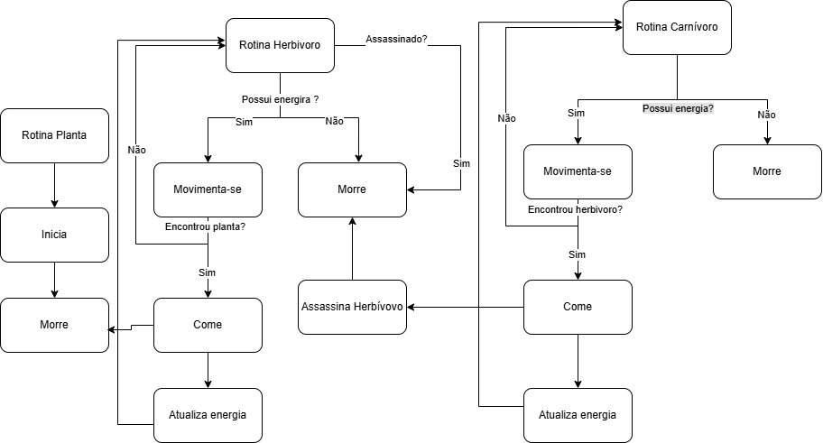

# ParaDigaMais

**Disciplina**: FGA0210 - PARADIGMAS DE PROGRAMAÇÃO - T01  
**Nro do Grupo**: 01 
**Paradigma**: SMA 

## Alunos

| Matrícula  | Aluno                         |
| ---------- | ----------------------------- |
| 19/0134224 | Artur Seppa Reiman            |
| 20/2015948 | Breno Henrique de Souza       |
| 22/2014984 | Edilberto Almeida Cantuaria   |
| 18/0121308 | Giulia Domingues de Alcantara |
| 17/0034941 | Guilherme Peixoto Lima        |
| 18/0042041 | Gustavo Barbosa de Oliveira   |
| 20/0069322 | Samuel Alves Sato             |

## O que é um paradigma SMA

O **paradigma de Sistemas Multiagentes (SMA)** é um modelo de programação que foca no desenvolvimento de sistemas compostos por múltiplos **agentes autônomos**, que interagem entre si e com o ambiente em que estão situados. Esses agentes são entidades computacionais que exibem as seguintes características principais: [1]

1. **Autonomia**: Agentes tomam decisões e executam ações de forma independente, sem intervenção direta de outros agentes ou do ambiente. [1]
2. **Reatividade**: Agentes percebem o ambiente ao seu redor e respondem às mudanças que ocorrem nele. [1]
3. **Pró-atividade**: Agentes agem de forma orientada a objetivos, ou seja, não apenas reagem ao ambiente, mas também buscam cumprir metas específicas. [1]
4. **Sociabilidade**: Agentes podem interagir com outros agentes ou sistemas para colaborar, competir ou coordenar ações em prol de um objetivo comum. [1]

No contexto do paradigma SMA, os agentes podem ser organizados em **arquiteturas** específicas, como as reativas (baseadas em ações imediatas), deliberativas (planejam suas ações com base em metas) ou híbridas, que combinam essas abordagens. [1]

O paradigma é amplamente utilizado em diversas áreas, como automação, gerenciamento de informações, telecomunicações, simulações, jogos e sistemas distribuídos, justamente por sua capacidade de lidar com sistemas complexos, dinâmicos e imprevisíveis. [1]

Aprenda mais sobre o Paradigma SMA [aqui](https://github.com/UnBParadigmas2024-2/2024.2-SMA-VidaSelvagem/blob/main/documentacao/vantagensDesvantagens.md)

## Sobre o Projeto

O projeto consiste em criar um simulador de vida selvagem usando o framework JADE em Java. Ele adota o paradigma de Sistemas Multiagentes (SMA) para modelar a interação entre diferentes tipos de agentes (herbívoros, carnívoros e plantas) em um ambiente simulado. O objetivo é observar e analisar como os agentes interagem e sobrevivem ao longo do tempo, com um foco no equilíbrio ecológico e nos ciclos de vida.

Para criação da interface utilizamos Java Swing, inspirados pelo projeto [Grid_Simulation](https://github.com/UnBParadigmas2021-2/2021.2_G1_SMA_Grid_Simulation)
### Relação do Paradigma SMA com o Projeto

O projeto do Simulador de Vida Selvagem está profundamente alinhado com o paradigma de Sistemas Multiagentes (SMA), que é uma abordagem da computação distribuída usada para modelar sistemas complexos compostos por múltiplos agentes autônomos. Esses agentes interagem entre si e com o ambiente, permitindo que comportamentos coletivos e dinâmicas emergentes sejam observados a partir de decisões locais e descentralizadas.

No contexto do simulador, o SMA é aplicado para representar e gerenciar o ecossistema selvagem, onde diferentes tipos de agentes (como herbívoros, carnívoros e plantas) coexistem e interagem em um ambiente dinâmico. Abaixo, exploramos como o projeto se relaciona com os princípios fundamentais do paradigma SMA.

### Por que optamos por um sistema de simulador de vida selvagem?

O projeto de simulação de vida selvagem foi escolhido como objeto de estudo para agentes autônomos utilizando a plataforma Java JADE devido à sua capacidade de representar de forma realista e dinâmica o comportamento de agentes em um ambiente complexo e interdependente. Este tipo de simulação permite modelar interações naturais, como a busca por recursos, predadores e presas.

## Screenshots

### Fluxograma do Projeto

- OBS: Para maior detalhamento de cada funcionalidade, acesse [esse link](https://github.com/UnBParadigmas2024-2/2024.2-SMA-VidaSelvagem/blob/main/documentacao/passoapasso-uso.md)

## Manual

### Uso

[Como executar o projeto](./documentacao/passoapasso-uso.md)

### Instalação

**Linguagens**: Java 
**Tecnologias**: Sistema Operacional Linux, Framework Jade, VSCode, IDE Intellij ou Eclipse 

- Para instalação do projeto, acesse [esse link](https://github.com/UnBParadigmas2024-2/2024.2-SMA-VidaSelvagem/blob/main/documentacao/passoapasso-instalar.md) e leia o passo a passo.

#### Como usar o projeto

- Para conseguir rodar o projeto, acesse [esse link](https://github.com/UnBParadigmas2024-2/2024.2-SMA-VidaSelvagem/blob/main/code/simulador/README.md)

## Vídeo

Vídeo disponível no [link](https://youtu.be/W71J1-5DlYg).

## Participações

Apresente, brevemente, como cada membro do grupo contribuiu para o projeto.

| Nome do Membro | Contribuição | Significância da Contribuição para o Projeto (Excelente/Boa/Regular/Ruim/Nula) | Comprobatórios |
| -- | -- | -- | -- |
| Artur Seppa Reiman | Vantagens e Desvantagens do Paradigma SMA | Regular | [Vantagens e Desvantagens](https://github.com/UnBParadigmas2024-2/2024.2-SMA-VidaSelvagem/commit/9822c99ddb02bd03cc2630f800b608295179b75e); |
| Breno Henrique de Souza | Manual de Uso do Projeto, Criação dos Agentes, Desenvolvimento das ações de Reprodução e Alimentação dos Agentes, Refatoração de algumas funções do projeto, Conversão de Linguagem pra Java, Matar caso energia acabe | Excelente | [Manual de Uso](https://github.com/UnBParadigmas2024-2/2024.2-SMA-VidaSelvagem/commit/35baa78a23a9a179e1ecc2df33a72787e9ed7630); [Definição dos Agentes](https://github.com/UnBParadigmas2024-2/2024.2-SMA-VidaSelvagem/commit/986108e46cf2d828c3e9750a9c1d1c93482652eb); [Conversão de Linguagem pra Java](https://github.com/UnBParadigmas2024-2/2024.2-SMA-VidaSelvagem/commit/112055af5832612de9a3071b17ad7fb587c3e501); [Matar caso energia acabe](https://github.com/UnBParadigmas2024-2/2024.2-SMA-VidaSelvagem/commit/4ebb44d4bb0d7945c6e3ffd189449ff88b4a4d96) | 
| Edilberto Almeida Cantuaria | Contribuições e Fragilidades, Trabalhos Futuros, tentativa de mostrar configuração do ambiente em JADE | Boa | [Contribuições e Fragilidades](https://github.com/UnBParadigmas2024-2/2024.2-SMA-VidaSelvagem/commit/04c30bc40a58bba373e1c6491e21da2c14f079e7); [Trabalhos Futuros](https://github.com/UnBParadigmas2024-2/2024.2-SMA-VidaSelvagem/commit/0c1bb48011fd611bd3f26a29ce156ca536331b8e);   | 
| Giulia Domingues de Alcantara | Documentação do Projeto, Manual de Instalação do Projeto, Criação dos Agentes, Desenvolvimento das ações de Reprodução e Alimentação dos Agentes, Criação da Main, Conversão de Linguagem pra Java, Matar caso energia acabe | Excelente |  [Documentação Inicial + Manual de Instalação](https://github.com/UnBParadigmas2024-2/2024.2-SMA-VidaSelvagem/commit/af12e596d8228c0e7ec80b20a4e16542bf4a0e44); [Criação da Main](https://github.com/UnBParadigmas2024-2/2024.2-SMA-VidaSelvagem/commit/4b5d72f7187173a1eaa4a43e2c86521f7e36b5a4); [Definição dos Agentes](https://github.com/UnBParadigmas2024-2/2024.2-SMA-VidaSelvagem/commit/986108e46cf2d828c3e9750a9c1d1c93482652eb); [Conversão de Linguagem pra Java](https://github.com/UnBParadigmas2024-2/2024.2-SMA-VidaSelvagem/commit/112055af5832612de9a3071b17ad7fb587c3e501); [Matar caso energia acabe](https://github.com/UnBParadigmas2024-2/2024.2-SMA-VidaSelvagem/commit/4ebb44d4bb0d7945c6e3ffd189449ff88b4a4d96) | 
| Guilherme Peixoto Lima |Fluxo do projeto, passo a passo, correção de links| Boa | [Fluxo do projeto](https://github.com/UnBParadigmas2024-2/2024.2-SMA-VidaSelvagem/commit/c42c262cf5715e86c1e689d7c82d5fb5d4aa7bef)  [passo a passo](https://github.com/UnBParadigmas2024-2/2024.2-SMA-VidaSelvagem/commit/93484cd64b6dc30fa3f7a1896c057e26936227b2)|  
| Gustavo Barbosa de Oliveira | Adição de premissas para criação do projeto; Matar agente caso energia acabe; Documentação| Boa | [Adição de premissas para criação do projeto](https://github.com/UnBParadigmas2024-2/2024.2-SMA-VidaSelvagem/commit/c57449ec90989057e57e8ac3e27effb79432ce10); [Matar agente caso energia acabe](https://github.com/UnBParadigmas2024-2/2024.2-SMA-VidaSelvagem/commit/4ebb44d4bb0d7945c6e3ffd189449ff88b4a4d96);[Adiciona Percepções](https://github.com/UnBParadigmas2024-2/2024.2-SMA-VidaSelvagem/commit/e468120cb93ca1ac3753702d73d5ef83f5031610); [Adiciona Lições Aprendidas](https://github.com/UnBParadigmas2024-2/2024.2-SMA-VidaSelvagem/commit/7ed23d53b21a79c80fe5bb89deb10322ed87b1c3)| 
| Samuel Alves Sato | Interface com Java Swing, Como rodar Jade, Comportamento dos agentes, Animais comerem | Excelente | [Interface com Java Swing](https://github.com/UnBParadigmas2024-2/2024.2-SMA-VidaSelvagem/commit/d29314868cec677df2eda8f79618f85de5be75f9), [Como rodar Jade](https://github.com/UnBParadigmas2024-2/2024.2-SMA-VidaSelvagem/commit/0ffa7385efaef13860cf98e4442987b8bb96c793),[Comportamento dos agentes](https://github.com/UnBParadigmas2024-2/2024.2-SMA-VidaSelvagem/commit/112055af5832612de9a3071b17ad7fb587c3e501), [Animais comerem](https://github.com/UnBParadigmas2024-2/2024.2-SMA-VidaSelvagem/commit/6ecd4442ae05dbe7c23e843f2f8ea034713e402d) | 

## Outros

### Lições Aprendidas

1. (Artur e Gustavo) - Importância do Planejamento Detalhado: Subestimar a complexidade inicial do paradigma SMA e das tecnologias utilizadas resultou em atrasos que poderiam ter sido mitigados com um planejamento mais detalhado e realista. 

2. (Guilherme e Samuel) - Configuração do Ambiente como Etapa Crítica: O setup inicial do ambiente foi um ponto crítico e evidenciou a importância de dedicar tempo para preparar e validar as ferramentas e dependências antes de iniciar o desenvolvimento. Documentar esse processo pode ajudar a reduzir atrasos futuros e facilitar o onboarding.

3. (Breno e Giulia) - Aprendizado Contínuo é Essencial: Trabalhar com um paradigma relativamente novo para a maioria dos integrantes reforçou a necessidade de estudos constantes e do compartilhamento de conhecimentos entre os membros.

### Percepções

A experiência com o desenvolvimento do projeto utilizando o paradigma de Sistemas Multiagentes revelou desafios aprendizados. Entre as principais percepções, destacamos:

1. Dificuldades no Setup do Ambiente: A configuração inicial do ambiente de desenvolvimento foi um dos maiores desafios enfrentados. Problemas com dependências do PADE e compatibilidade com o sistema operacional atrasaram significativamente o início do trabalho. Esse atraso impactou o cronograma geral e exigiu adaptações nas entregas previstas.

2. Curva de Aprendizado Elevada: O paradigma SMA, embora poderoso e promissor, apresentou uma curva de aprendizado considerável. Compreender as nuances da autonomia, reatividade, pró-atividade e sociabilidade dos agentes demandou mais tempo e esforço do que inicialmente planejado.

3. Coordenação e Divisão de Tarefas: Gerir um projeto em grupo com diversas tarefas simultâneas também se mostrou complicado.

4. Integração dos Componentes: Outro ponto desafiador foi garantir que as contribuições individuais convergissem para um sistema coeso e funcional. A integração das funcionalidades desenvolvidas separadamente gerou retrabalho em algumas partes do projeto.

Essa jornada reforçou a importância do planejamento inicial, da comunicação clara e da colaboração ativa em projetos complexos. Embora o caminho tenha sido repleto de desafios, ele também proporcionou aprendizado para todos os membros do grupo.

### Contribuições e Fragilidades

#### Contribuições
- **Alinhamento ao Paradigma SMA:** O projeto se passa em um contexto real para aplicar os conceitos centrais do paradigma SMA, como autonomia, reatividade e pró-atividade dos agentes. A criação do simulador permitiu observar dinâmicas emergentes e comportamentos complexos, atendendo ao objetivo inicial de modelar a vida selvagem.

**Distribuição de Tarefas:** Os membros do grupo que contribuíram de forma ativa (como Breno, Giulia e Gustavo) desempenharam papéis significativos, tanto no desenvolvimento técnico quanto na documentação, o que foi essencial para o progresso do projeto.

**Aprendizado Coletivo:** A experiência evidenciou a importância de compartilhar conhecimento técnico entre os membros, o que ajudou a superar dificuldades relacionadas à curva de aprendizado do paradigma SMA.

###### Fragilidades
**Planejamento e Cronograma:** A subestimação inicial da complexidade do paradigma SMA e da configuração do ambiente resultou em atrasos e retrabalho, evidenciando a necessidade de um planejamento mais detalhado.

**Integração de Componentes:** O relato de retrabalhos durante a integração dos componentes do projeto mostra que a coordenação e validação das funcionalidades individuais precisavam ser mais bem estruturadas.

**Curva de Aprendizado:** A dificuldade enfrentada por muitos integrantes ao lidar com o paradigma SMA atrasou o progresso coletivo. Estratégias de estudo mais focadas poderiam ter sido implementadas desde o início.

**Problemas no Setup do Ambiente:** A configuração inicial do ambiente, com dificuldades em dependências e compatibilidades, atrasou significativamente o trabalho, indicando que mais tempo deveria ter sido dedicado a essa etapa inicial.

### Trabalhos Futuros
Os exemplos a seguir ilustram cenários de interação entre agentes inteligentes e seus ambientes. Cada caso demonstra como agentes podem se comunicar e colaborar, ajustando suas ações em resposta às mudanças no ambiente para alcançar objetivos específicos.
1. **Gerenciamento de Tráfego Urbano**
- **Agentes**: Semáforos inteligentes, sensores de tráfego, veículos conectados.
- **Ambiente**: Ruas, cruzamentos e fluxo de veículos.
- **Interação**: Semáforos ajustam seus tempos com base nos dados dos sensores para otimizar o fluxo de tráfego. Veículos conectados podem se comunicar com os semáforos para prever o tempo de espera.

2. **Simulação de Evacuação em Emergências**
- **Agentes**: Pessoas ou robôs simulados, socorristas virtuais.
- **Ambiente**: Um edifício ou espaço público com múltiplas saídas e obstáculos.
- **Interação**: Pessoas simuladas buscam rotas seguras, enquanto os socorristas orientam as evacuações. As decisões são adaptadas em tempo real conforme o ambiente (como incêndios ou bloqueios).

3. **Gerenciamento de Estoques em Logística**
- **Agentes**: Robôs autônomos de armazém, como os usados pela Amazon, e sistemas de gerenciamento de estoque.
- **Ambiente**: Depósito ou armazém com prateleiras e corredores.
- **Interação**: Robôs comunicam-se para evitar colisões e dividir tarefas, otimizando o transporte de itens entre prateleiras e pontos de expedição.

4. **Jogos de Estratégia e RPGs**
- **Agentes**: Personagens não jogáveis (NPCs), como inimigos ou aliados.
- **Ambiente**: O mapa do jogo, com terrenos, obstáculos e recursos.
- **Interação**: NPCs colaboram ou competem com o jogador. Por exemplo, inimigos podem formar alianças para atacar, enquanto aliados ajudam o jogador em missões.

5. **Sistema de Energia Inteligente (Smart Grid)**
- **Agentes**: Consumidores, geradores de energia (usinas, painéis solares) e sistemas de controle.
- **Ambiente**: Rede elétrica, incluindo infraestrutura de distribuição e medição.
- **Interação**: Geradores e consumidores ajustam o fornecimento e consumo de energia com base nas condições da rede, otimizando eficiência e reduzindo desperdícios.

6. **Robótica Cooperativa**
- **Agentes**: Vários robôs, como drones ou robôs terrestres.
- **Ambiente**: Espaços internos (fábricas) ou externos (áreas de resgate).
- **Interação**: Os robôs compartilham informações para completar uma tarefa, como mapear uma área desconhecida ou buscar vítimas em uma zona de desastre.

7. **E-Commerce e Negociação Automática**
- **Agentes**: Consumidores simulados, vendedores e intermediários.
- **Ambiente**: Plataforma de e-commerce ou sistema de leilões.
- **Interação**: Agentes negociam preços, prazos de entrega e condições de pagamento de maneira automática e adaptativa, otimizando os interesses de seus usuários.

## Fontes

[1] RAFAEL. **Introdução ao paradigma orientado a agentes**. DevMedia, 2013. Disponível em: <https://www.devmedia.com.br/introducao-ao-paradigma-orientado-a-agentes/28791>. Acesso em: 20 jan. 2025.
